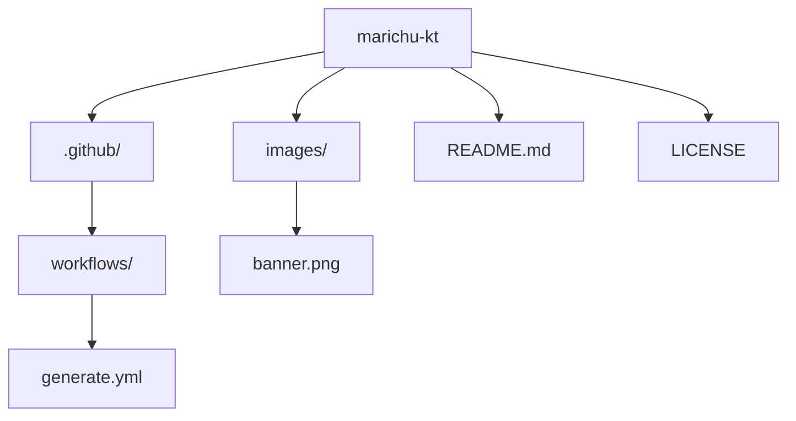

###

<h1 align="center">
  
</h1>

###

###

  <!-- Stats generales -->
  

###

<!-- Lenguajes y SO-->

  <a href="https://skillicons.dev">
    <!-- Fila 1 -->
    
     
    <!-- Fila 2 -->
    
     
    <!-- Fila 2 -->
    
  </a>

###

###

| Thank you for your support! You can donate using the info below 🙏 |
|--------------------------------------------------------------------|
| 🪙 Currency | Address                  | QR Code                          |
|--------|---------------------------|----------------------------------|
| ₿ BTC  | `bc1qa83g3mxrzrw52ke0lvt4qr36qpywqykgt74f2g`     |         |

###

  

###

<!-- Snake Animation con enlace a Platane/snk -->

###
