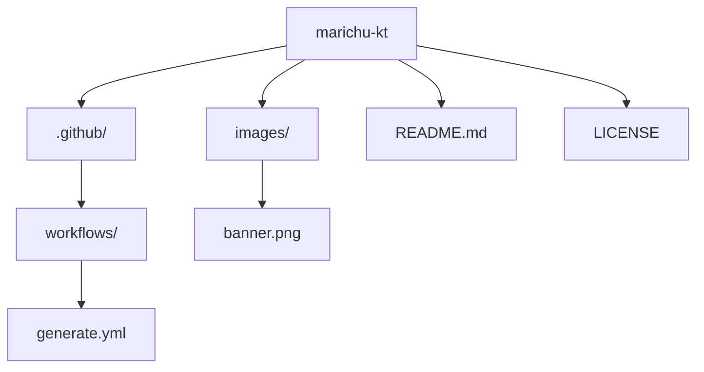

###

<h1 align="center">
  
   
  
</h1>

###

###

###

  <!-- Stats generales -->
  

###
###

<!-- Lenguajes y SO-->

  <a href="https://skillicons.dev">
    <!-- Fila 1 -->
    
     
    <!-- Fila 2 -->
    
     
    <!-- Fila 2 -->
    
  </a>

###

###

<!-- Snake Animation con enlace a Platane/snk -->

###
