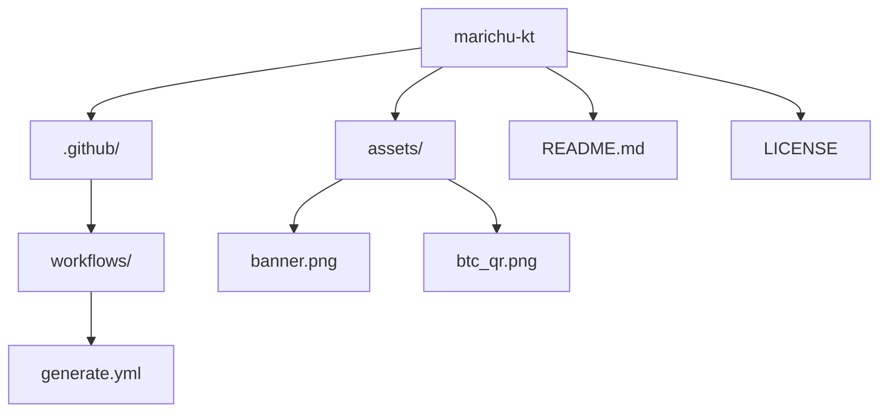

<!-- Header SVG -->

###

<!-- Mensaje bienvenida -->
<h1 align="center">
  
</h1>

###

<!-- Banner -->

###

<!-- Stats generales -->

  

###

<!-- Lenguajes, Herramientas y Plataformas -->

  <a href="https://skillicons.dev">
    <!-- Fila 1 -->
    
     
    <!-- Fila 2 -->
    
     
    <!-- Fila 3 -->
    
     
    <!-- Fila 4 -->
    
  </a>

###

<!-- Mermaid -->

###

<!-- Donaciones -->

<table>
  <tr>
    <td colspan="3" align="center">
      <b>💚 Thank you for your support! You can donate using the info below 🙏</b>
    </td>
  </tr>
  <tr>
    <th>🪙 Coin</th>
    <th>Address</th>
    <th>QR Code</th>
  </tr>
  <tr>
    <td>₿ BTC</td>
    <td><code>bc1qa83g3mxrzrw52ke0lvt4qr36qpywqykgt74f2g</code></td>
    <td></td>
  </tr>
</table>

###

<!-- Contador de visitas paises (FlagCounter) -->

  

###

<!-- Snake Animation con enlace a Platane/snk -->

###

<!-- Contador de visitas -->

  

###

<!-- Footer SVG -->

